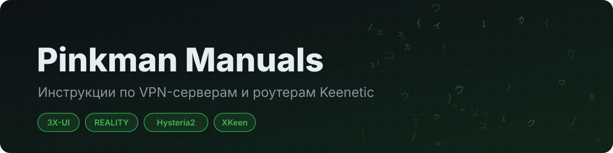

**Пошаговые инструкции: свой VPN-сервер за 15 минут и прокси на роутере Keenetic**

[Инструкции](#инструкции) · [Что понадобится](#что-понадобится) · [Полезное](#полезное)

---

Здесь собраны короткие проверенные инструкции: как поднять VPN-сервер на
3X-UI или Hysteria2 и направить трафик через прокси прямо на роутере
Keenetic с XKeen. Каждая инструкция —
одна страница: команды, которые нужно скопировать, и схемы нужных настроек.

## Инструкции

| | Инструкция | Что получится | Сложность |
|---|---|---|---|
| 🛡 | [3X-UI Pro с REALITY](manuals/3x-ui-pro-reality.md) | Панель, VLESS REALITY и подписки на 443 порту за nginx | ●●○ |
| ⚡ | [3X-UI с 4 инбаундами](manuals/3x-ui-4-inbounds.md) | То же одной командой, без своих доменов | ●○○ |
| 🚀 | [Hysteria2 (Blitz)](manuals/hysteria2-blitz.md) | Быстрый протокол на UDP с веб-панелью | ●○○ |
| 📶 | [XKeen на Keenetic](manuals/xkeen-keenetic.md) | Прокси для выбранных устройств прямо на роутере | ●●○ |

> [!WARNING]
> Инструкции подготовлены в образовательных целях. Убедитесь, что ваши
> действия соответствуют законодательству вашей страны.

## Что понадобится

- VPS с **Ubuntu 24.04** или **Debian 12** и доступом по SSH
- Для 3X-UI Pro — **два домена или сабдомена**, направленных на IP сервера
  (для «4 инбаундов» домены не нужны)
- Для XKeen — роутер **Keenetic/Netcraze** и USB-флешка

## Полезное

- [XKeen](https://github.com/jameszeroX/XKeen) и его [вики](https://github.com/jameszeroX/XKeen/wiki) — документация по маршрутизации на Keenetic
- [XKeen UI](https://github.com/zxc-rv/XKeen-UI) — веб-интерфейс для XKeen
- [Генератор Outbound](https://zxc-rv.github.io/XKeen-UI/Outbound_Generator/) — превращает ссылку `vless://` в `04_outbounds.json`
- [Генератор конфигураций Mihomo](https://rockblack.info/mihomo_generator) от RockBlack
- [IP-адреса для AmneziaWG](https://github.com/RockBlack-VPN/ip-address) — актуальные списки от RockBlack

## Благодарности

Инструкции опираются на работу авторов этих проектов:
[x-ui-pro](https://github.com/mozaroc/x-ui-pro) ·
[3X-UI](https://github.com/MHSanaei/3x-ui) ·
[Blitz](https://github.com/ReturnFI/Blitz) ·
[Hysteria](https://github.com/apernet/hysteria) ·
[XKeen](https://github.com/jameszeroX/XKeen) ·
[Xray-core](https://github.com/XTLS/Xray-core)
