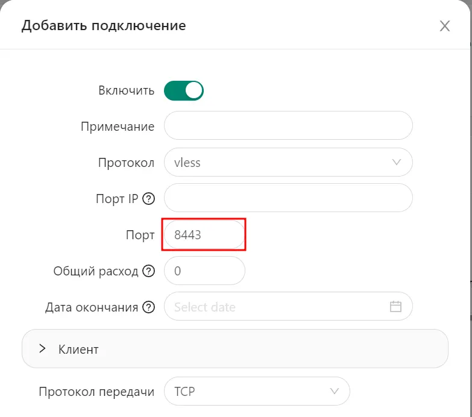

# 3X-UI-pro with REALITY

Что новый скрипт делает: 

1. Устанавливает 3x-ui или x-ui
2. Устанавливает и настраивает nginx для реверспроксирования не только самой панели но и инбаундов vless/trojan c транспортами WebSocket/GRPC так же инбаунда vless с транспортом REALITY и инбаунд xhttp
3. Создает два инбаунда vless+reality и vless+websocket
4. Включает подписки на порту 443
5. Получает и настраивает SSL сертификаты для доменов или сабдоменов
6. Устанавливает фейковый сайт
7. Настраивает фаервол, остаются открытыми только порты 22, 80 и 443

## Установка

1. Коннектимся к серверу по ssh
2. Запускаем команду:

```bash
sudo su -c "bash <(wget -qO- https://raw.githubusercontent.com/mozaroc/x-ui-pro/refs/heads/master/x-ui-pro.sh) -install yes -panel 1 -ONLY_CF_IP_ALLOW no"
```

1. Скрипт попросит указать ваши домены, сначала для панели, затем для реалити.
2. По окончанию работы сохраните ссылку на вход, логин и пароль.

## Настройка REALITY

1. Идите в подключения и создайте новый: тип **vless**, транспорт **tcp**, безопасность **REALITY**.
2. Порт обязательно **8443**.



3. Включите **Proxy Protocol**.


4. Включите внешний прокси (порт 443). В поле **Dest** укажите домен под который маскируетесь и порт **9443**.


