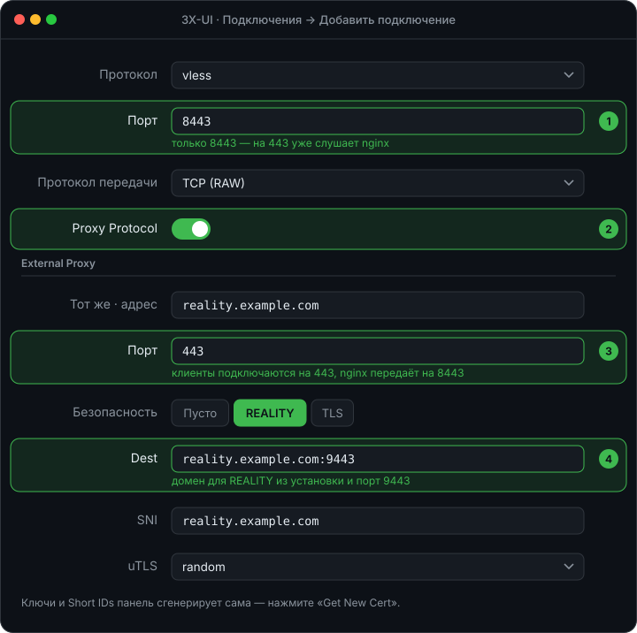

# 🛡 3X-UI Pro с REALITY

Скрипт [x-ui-pro](https://github.com/mozaroc/x-ui-pro) ставит панель 3X-UI за
nginx, так что панель, подписки и все подключения работают на одном 443 порту
и снаружи выглядят как обычный сайт.

**Что делает скрипт:**

- устанавливает 3X-UI и nginx, получает SSL-сертификаты и продлевает их сам;
- создаёт подключения VLESS + REALITY и VLESS + WebSocket;
- включает подписки на 443 порту и страницу подписки для клиентов;
- ставит случайный сайт-заглушку;
- закрывает на фаерволе всё, кроме портов 22, 80 и 443.

## Что понадобится

- VPS с Ubuntu 24.04 или Debian 12
- **Два домена или сабдомена**, A-записи которых указывают на IP сервера:
  первый — для панели, второй — для REALITY

> [!TIP]
> Нет своих доменов — возьмите бесплатные сабдомены или используйте
> [установку с 4 инбаундами](3x-ui-4-inbounds.md): там домены выдаются
> автоматически.

## Установка

1. Подключитесь к серверу по SSH.
2. Запустите установку:

```bash
sudo su -c "bash <(wget -qO- https://raw.githubusercontent.com/mozaroc/x-ui-pro/master/x-ui-pro.sh) -install yes -panel 1 -ONLY_CF_IP_ALLOW no"
```

3. Скрипт спросит домены: сначала для панели, затем для REALITY.
4. В конце он покажет адрес панели, логин и пароль — **сохраните их**.

> [!WARNING]
> Не меняйте домены после установки — иначе сертификаты не продлятся.

## Своё подключение REALITY

Скрипт уже создал рабочее подключение. Если нужно добавить ещё одно,
в панели откройте **Подключения → Добавить подключение**:



1. **Порт — только `8443`.** На 443 слушает nginx и сам передаёт трафик дальше.
2. Включите **Proxy Protocol** — так nginx передаст настоящий IP клиента.
3. Включите **External Proxy**: адрес — ваш домен, порт `443`. Именно он
   попадёт в ссылку для клиента.
4. Безопасность **REALITY**, в **Dest** — домен для REALITY и порт `9443`,
   в **SNI** — тот же домен. Нажмите **Get New Cert**, чтобы сгенерировать
   ключи, и сохраните подключение.

## Обслуживание

Резервная копия панели и настроек nginx:

```bash
sudo su -c "bash <(wget -qO- https://raw.githubusercontent.com/mozaroc/x-ui-pro/master/backup.sh)"
```

Удаление:

```bash
sudo su -c "bash <(wget -qO- https://raw.githubusercontent.com/mozaroc/x-ui-pro/master/x-ui-pro.sh) -uninstall yes"
```
