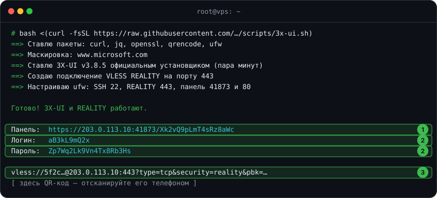

# 🛡 3X-UI + REALITY

[← Все инструкции](../README.md#инструкции)

Одна команда ставит панель [3X-UI](https://github.com/MHSanaei/3x-ui) и сразу
создаёт рабочее подключение VLESS REALITY. Домены не нужны.

**Что делает [скрипт](../scripts/3x-ui.sh):**

- ставит официальную 3X-UI проверенной версии её собственным установщиком;
- выпускает для панели сертификат Let's Encrypt на IP сервера и сам его продлевает;
- прячет панель на случайном порту и случайном пути, со случайными логином и паролем;
- подбирает сайт для маскировки REALITY — проверяет, что тот отвечает по TLS 1.3 и HTTP/2;
- создаёт подключение VLESS REALITY на 443 порту и первого клиента;
- открывает в ufw только нужные порты;
- выдаёт ссылку `vless://` и QR-код.

## Что понадобится

- VPS с Ubuntu 22.04/24.04 или Debian 12/13, доступ root по SSH
- Свободные порты **443** и **80** — на свежем сервере они свободны

## Установка

Подключитесь к серверу по SSH и выполните:

```bash
bash <(curl -fsSL https://raw.githubusercontent.com/itsnotkubrick/Reality_Hysteria2/main/scripts/3x-ui.sh)
```

Через пару минут скрипт покажет всё нужное:



1. **Адрес панели** — откройте его в браузере.
2. **Логин и пароль** от панели.
3. **Ссылка для подключения** — вставьте её в клиент или отсканируйте QR-код.

Всё это сохраняется в файл `/root/3x-ui.txt` — посмотреть снова: `cat /root/3x-ui.txt`.

## Подключение

Ссылку `vless://` поддерживают:

| Устройство | Приложение |
|---|---|
| iPhone, iPad | Streisand, Happ, Hiddify |
| Android | Hiddify, v2rayNG, Happ |
| Windows, macOS, Linux | Hiddify, v2rayN |

В приложении нажмите **+** → **Импорт из буфера** или отсканируйте QR-код.

## Добавить друга

В панели откройте **Клиенты → Добавить клиента**, выберите подключение
**REALITY**, задайте имя и при желании лимит трафика и срок. Ссылку для
друга покажет кнопка **QR-код** рядом с клиентом.

## Параметры

Команду можно запустить с параметрами — например, если порт 443 уже занят:

```bash
bash <(curl -fsSL https://raw.githubusercontent.com/itsnotkubrick/Reality_Hysteria2/main/scripts/3x-ui.sh) --port 8443
```

| Параметр | Что делает |
|---|---|
| `--port 8443` | порт REALITY вместо 443 |
| `--sni www.apple.com` | свой сайт для маскировки |
| `--panel-ssl none` | без сертификата: панель будет доступна только через SSH-туннель |
| `--no-ufw` | не трогать файрвол |

> [!NOTE]
> Если порт 80 занят, сертификат для панели не получить — скрипт сам
> переключится на доступ через SSH-туннель и покажет нужную команду.

## Обслуживание

Управление панелью — официальная команда `x-ui`: перезапуск, логи,
обновление, удаление.

```bash
x-ui
```

---

[← Все инструкции](../README.md#инструкции) · [Дальше: 🚀 Hysteria2 →](hysteria2.md)
