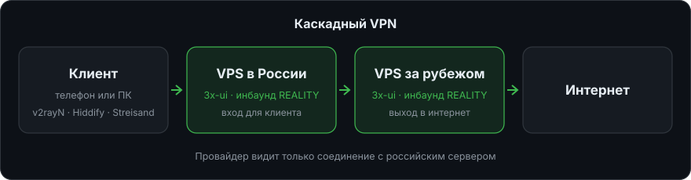
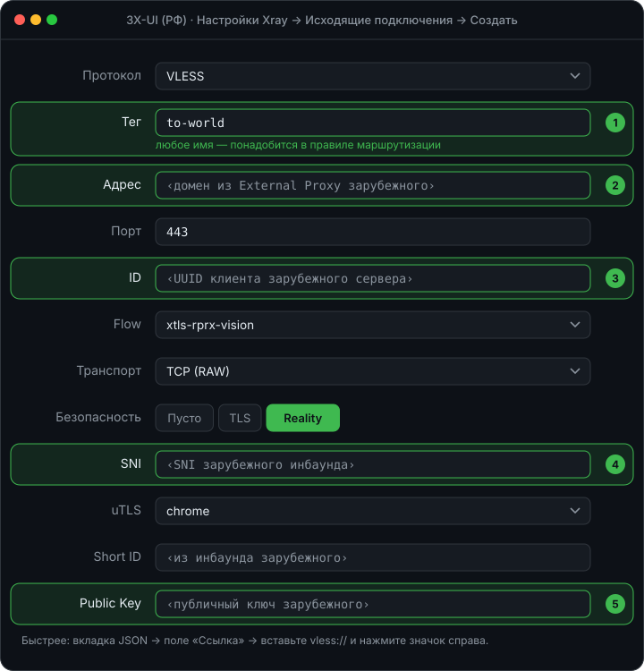
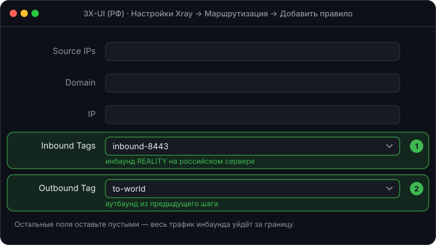

# 🔗 Каскадный VPN

[← Все инструкции](../README.md#инструкции)

Клиент подключается к серверу в России, а тот пересылает трафик на
зарубежный сервер. Провайдер видит только соединение с российским IP,
а сайты — зарубежный.



## Что понадобится

- Сервер в России с Ubuntu 24.04
- Сервер за рубежом с Ubuntu 24.04

Домены не нужны: скрипт выдаст их автоматически.

## 1. Установите 3X-UI на оба сервера

Выполните на **каждом** сервере:

```bash
sudo su -c "bash <(wget -qO- https://raw.githubusercontent.com/mozaroc/x-ui-pro/master/x-ui-pro.sh) -install yes -panel 1 -ONLY_CF_IP_ALLOW no -auto_domain y"
```

Сохраните адреса панелей, логины и пароли. Подробнее про установку —
в [3X-UI с 4 инбаундами](3x-ui-4-inbounds.md).

## 2. Возьмите ссылку зарубежного сервера

В панели **зарубежного** сервера откройте подключение VLESS REALITY и
скопируйте ссылку клиента `vless://…`. Из неё понадобятся адрес, UUID, SNI,
Short ID и публичный ключ.

## 3. Создайте аутбаунд на российском сервере

В панели **российского** сервера: **Настройки Xray → Аутбаунды → Создать аутбаунд**.



1. **Тег** — любое имя, например `to-world`.
2. **Адрес** — домен из External Proxy зарубежного сервера, порт `443`.
3. **ID** — UUID клиента зарубежного сервера, Flow `xtls-rprx-vision`.
4. Безопасность **Reality**, **SNI** — как у зарубежного подключения.
5. **Public Key** и **Short ID** — из зарубежного подключения.

> [!TIP]
> Быстрее: переключитесь на вкладку **JSON** и вставьте ссылку `vless://` —
> панель заполнит поля сама.

## 4. Направьте трафик в каскад

**Настройки Xray → Маршрутизация → Добавить правило**:



1. **Inbound Tags** — инбаунд REALITY российского сервера (`inbound-8443`).
2. **Outbound Tag** — аутбаунд из прошлого шага (`to-world`).

Сохраните настройки и перезапустите Xray кнопкой вверху страницы.

## 5. Проверьте

Подключитесь клиентом к **российскому** серверу и откройте
[2ip.ru](https://2ip.ru): должен показаться IP зарубежного сервера.

---

[← Все инструкции](../README.md#инструкции) · [Дальше: 📶 XKeen на Keenetic →](xkeen-keenetic.md)
