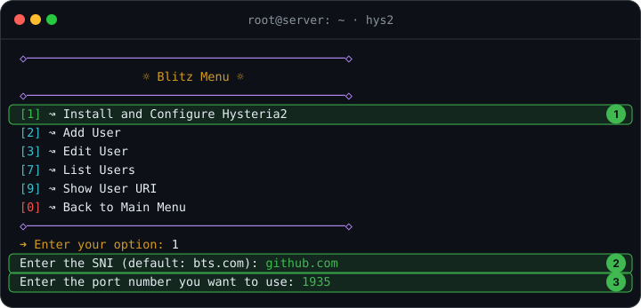
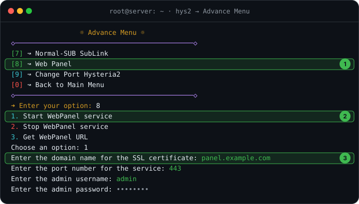
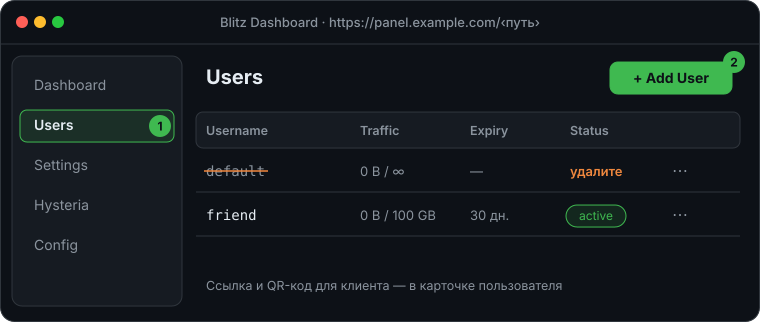

# 🚀 Hysteria2 (Blitz)

[Hysteria2](https://github.com/apernet/hysteria) работает поверх UDP и
хорошо держит скорость на нестабильных каналах — отличная пара к VLESS.
Панель [Blitz](https://github.com/ReturnFI/Blitz) ставит его одной командой
и даёт веб-интерфейс для пользователей.

## Что понадобится

- VPS с Ubuntu 24.04
- Домен для веб-панели (A-запись на IP сервера)

## 1. Обновите систему

```bash
apt update && apt upgrade -y
```

## 2. Установите Blitz

```bash
bash <(curl https://raw.githubusercontent.com/ReturnFI/Blitz/main/install.sh)
```

После установки меню открывается командой `hys2` — ставить заново не нужно.

## 3. Установите Hysteria2

В меню выберите **[1] Hysteria2 Menu**, затем:



1. **[1] Install and Configure Hysteria2**.
2. SNI — любой популярный сайт, например `github.com`.
3. Порт — любой свободный UDP-порт, например `1935`.

> [!TIP]
> Hysteria2 не нужен 443 порт: он не притворяется сайтом, как REALITY.
> Оставьте 443 для веб-панели и подписок.

## 4. Включите веб-панель

Вернитесь в главное меню и откройте **[2] Advance Menu**:



1. **[8] Web Panel**.
2. **1. Start WebPanel service**.
3. Укажите домен, порт `443`, логин и пароль администратора.

Адрес панели потом можно посмотреть там же, пунктом **3. Get WebPanel URL**.

## 5. Добавьте пользователя

Откройте панель в браузере и перейдите во вкладку **Users**:



1. Удалите пользователя по умолчанию.
2. Создайте своего кнопкой **+** — с лимитом трафика и сроком, если нужно.

Ссылку `hy2://` или QR-код отправьте в клиент: Hiddify, v2rayN, Streisand,
NekoBox.
