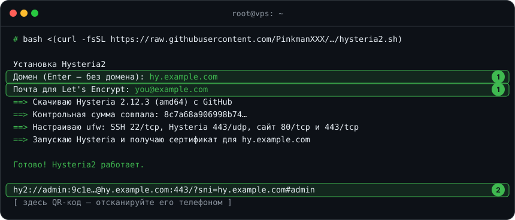
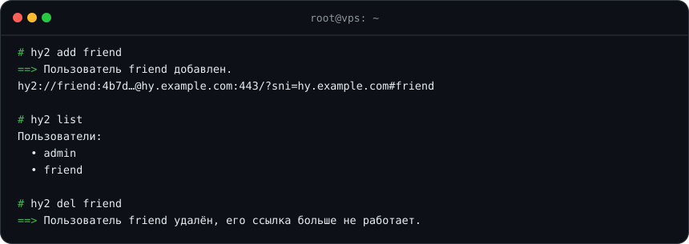

# 🚀 Hysteria2

[← Все инструкции](../README.md#инструкции)

[Hysteria2](https://github.com/HyNetworks/hysteria) работает поверх UDP и
хорошо держит скорость на плохих каналах — отличная пара к REALITY. Одна
команда ставит сервер, сертификат и сайт-заглушку и выдаёт готовую ссылку.

**Что делает [скрипт](../scripts/hysteria2.sh):**

- ставит официальный Hysteria2 проверенной версии и сверяет контрольную сумму;
- с доменом — получает сертификат Let's Encrypt, без домена — делает свой
  и закрепляет его отпечаток прямо в ссылке;
- поднимает сайт-заглушку: при заходе на ваш домен откроется страница
  «RETRYING CONNECTION»;
- создаёт пользователя со случайным паролем и открывает нужные порты в ufw;
- выдаёт ссылку `hy2://` и QR-код;
- ставит команду `hy2`, чтобы добавлять и удалять друзей без правки конфигов.

## Что понадобится

- VPS с Ubuntu 22.04/24.04 или Debian 12/13, доступ root по SSH
- По желанию — домен, A-запись которого указывает на IP сервера

## Установка

Подключитесь к серверу по SSH и выполните:

```bash
bash <(curl -fsSL https://raw.githubusercontent.com/PinkmanXXX/pinkman_manuals/main/scripts/hysteria2.sh)
```



1. Скрипт спросит **домен и почту**. Нет домена — просто нажмите Enter.
2. В конце он покажет **ссылку** `hy2://` и QR-код.

> [!TIP]
> Без домена всё тоже работает. Домен даёт настоящий сертификат и
> сайт-заглушку, так что сервер снаружи выглядит обычным сайтом.

## Подключение

Ссылку `hy2://` поддерживают:

| Устройство | Приложение |
|---|---|
| iPhone, iPad | Streisand, Hiddify, Happ |
| Android | Hiddify, NekoBox |
| Windows, macOS, Linux | Hiddify, v2rayN |

## Друзья и управление



| Команда | Что делает |
|---|---|
| `hy2 add имя` | добавить пользователя и показать его ссылку |
| `hy2 del имя` | удалить — его ссылка сразу перестанет работать |
| `hy2 list` | список пользователей |
| `hy2 link имя` | ссылка и QR-код ещё раз |
| `hy2 status` | версия, адрес и состояние |
| `hy2 update` | обновить до новой проверенной версии |
| `hy2 uninstall` | удалить всё |

## Если что-то пошло не так

- **«Не удалось получить сертификат»** — A-запись домена ещё не обновилась
  или порт 80 закрыт у хостера. Исправьте и выполните `hy2 restart`.
- **Клиент не подключается** — проверьте, что у хостера открыт UDP-порт 443
  (у некоторых хостеров есть свой файрвол в личном кабинете).
- **Порт 443 занят** — поставьте на другой: добавьте к команде установки `--port 8443`.

---

[← Все инструкции](../README.md#инструкции) · [Дальше: 📶 XKeen на Keenetic →](xkeen-keenetic.md)
