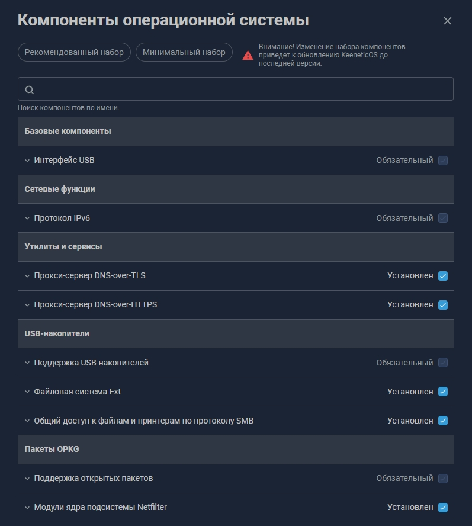
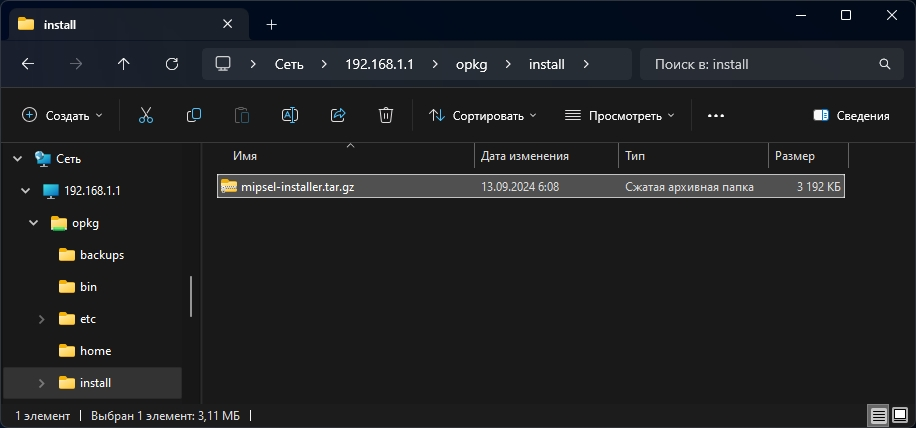
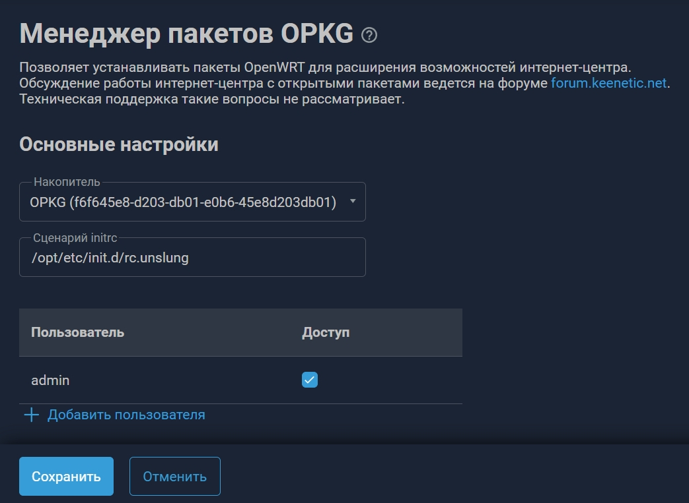

# Установка Xkeen на Keenetic

## 1. Подготовка
1. Подготовьте флешку в формате **ext4**.
2. Установите компоненты OPKG в роутере: "Поддержка открытых пакетов", "Интерфейс USB", "Файловая система Ext".



## 2. Установка Entware
1. Создайте папку `install` на флешке.
2. Скачайте нужный инсталлер (mipsel/mips/aarch64) и положите в папку.
3. В настройках OPKG выберите этот накопитель.



## 3. Установка XKeen
Подключитесь по SSH (порт 222, логин root, пароль keenetic) и выполните:

```bash
opkg update && opkg upgrade && opkg install curl tar
curl -sOfL https://raw.githubusercontent.com/jameszeroX/XKeen/main/install.sh
chmod +x ./install.sh
./install.sh
```

## 4. Настройка маршрутизации
В директории `/opt/etc/xray/configs/` настройте файлы `03_inbounds.json`, `04_outbounds.json` и `05_routing.json`.


