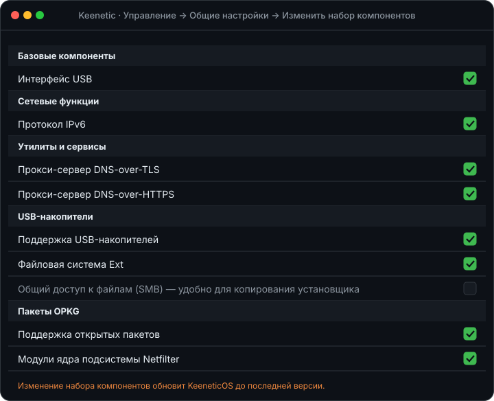
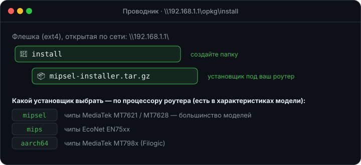
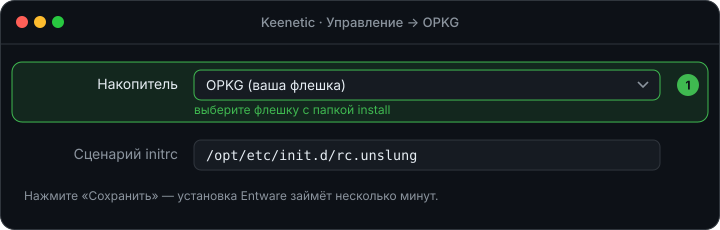
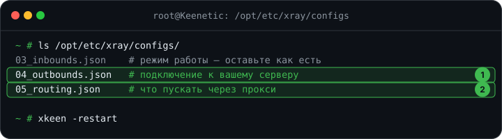

# 📶 XKeen на Keenetic

[← Все инструкции](../README.md#инструкции)

[XKeen](https://github.com/jameszeroX/XKeen) направляет через прокси
(Xray или Mihomo) трафик только выбранных устройств, а остальные ходят
в интернет напрямую. Всё работает на роутере — на телефоны и ПК ничего
ставить не нужно.

## Что понадобится

- Роутер **Keenetic** или **Netcraze** с USB-портом
- USB-флешка, отформатированная в **ext4**
- Свой сервер с VLESS — например, из [этой инструкции](3x-ui.md)

## 1. Установите компоненты

В веб-интерфейсе роутера: **Управление → Общие настройки → Изменить набор компонентов**.



Отметьте компоненты с галочками и установите. Роутер обновится
и перезагрузится.

## 2. Установите Entware

1. Вставьте флешку в роутер и откройте её по сети: `\\192.168.1.1\`.
2. Создайте папку `install` и положите туда установщик под процессор роутера:
   [mipsel](https://bin.entware.net/mipselsf-k3.4/installer/mipsel-installer.tar.gz),
   [mips](https://bin.entware.net/mipssf-k3.4/installer/mips-installer.tar.gz) или
   [aarch64](https://bin.entware.net/aarch64-k3.10/installer/aarch64-installer.tar.gz).



3. В разделе **Управление → OPKG** выберите флешку и сохраните.



Через несколько минут Entware установится. Подключиться к нему можно по SSH:
порт `222`, логин `root`, пароль `keenetic` — **сразу смените его** командой `passwd`.

## 3. Настройте DNS

Пропишите шифрованные DNS-серверы (DoT или DoH) по
[инструкции Keenetic](https://support.keenetic.ru/ultra/kn-1811/ru/31543-dot-and-doh-proxy-servers-for-dns-requests-encryption.html) —
без этого XKeen работает неправильно.

> [!IMPORTANT]
> **KeeneticOS 5.2 и новее.** XKeen нужен токен доступа к роутеру.
> Создайте его в разделе **Пользователи и доступ**, вставьте в
> [шаблон xkeen.json](https://github.com/jameszeroX/XKeen/releases/download/2.0.1_Beta/xkeen.json)
> и положите файл на роутер по пути `/opt/etc/xkeen/xkeen.json`.
> Подробнее — в [вики XKeen](https://github.com/jameszeroX/XKeen/wiki/Порядок-установки).

## 4. Установите XKeen

Подключитесь по SSH и выполните:

```bash
opkg update && opkg upgrade && opkg install curl tar && cd /tmp
sh -c "$(curl -sSL https://raw.githubusercontent.com/jameszeroX/XKeen/main/install.sh)"
```

Если GitHub недоступен, замените адрес на
`https://cdn.jsdelivr.net/gh/jameszeroX/XKeen@main/install.sh`.

Установщик спросит ядро (Xray или Mihomo), геобазы, нужно ли исключать
российские IP и добавлять XKeen в автозагрузку.

## 5. Подключите свой сервер

Для Xray нужны два файла в `/opt/etc/xray/configs/`:



1. `04_outbounds.json` — подключение к вашему серверу.
2. `05_routing.json` — какие сайты и сервисы пускать через прокси.

Оба файла собирает наш **[генератор Xray](https://itsnotkubrick.github.io/Reality_Hysteria2/tools/xray/)**:
вставьте ссылку `vless://`, отметьте сервисы — и получите одну команду,
которая сама запишет файлы на роутер и перезапустит XKeen. Для ядра Mihomo
и ссылок Hysteria2 есть **[генератор Mihomo](https://itsnotkubrick.github.io/Reality_Hysteria2/tools/mihomo/)**.

> [!NOTE]
> Генераторы работают прямо в браузере — ссылки с паролями никуда не отправляются.

Чтобы через прокси ходили только нужные устройства, в веб-интерфейсе откройте
**Приоритеты подключений → Политики доступа в Интернет**, создайте политику
с именем **`xkeen`** и перенесите в неё эти устройства.

> [!WARNING]
> Без политики `xkeen` через прокси пойдёт трафик **всех** устройств в сети.

> [!TIP]
> Управлять настройками удобнее из браузера — через
> [XKeen UI](https://github.com/zxc-rv/XKeen-UI).

---

[← Все инструкции](../README.md#инструкции)
